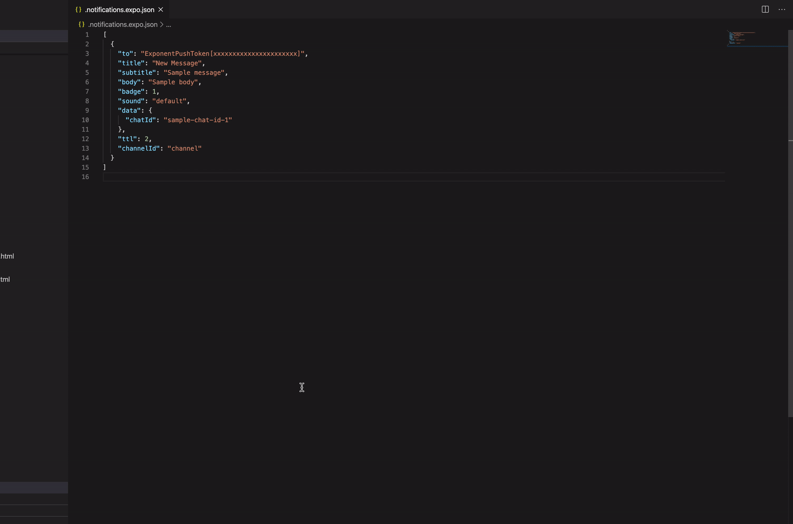

# Expo Toolkit: PUSH

**Expo Toolkit: PUSH** is simple vscode extension that allows you to send PUSH notifications right from your IDE. It works with [Expo applications](https://expo.io) and it's based on [Expo PUSH notifications tool](https://expo.io/notifications).

## Features

* Sending Expo PUSH notifications
* Saving notification payload for further use

**Enjoy!**
